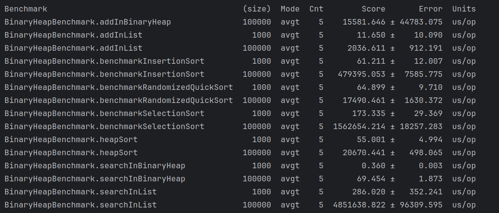
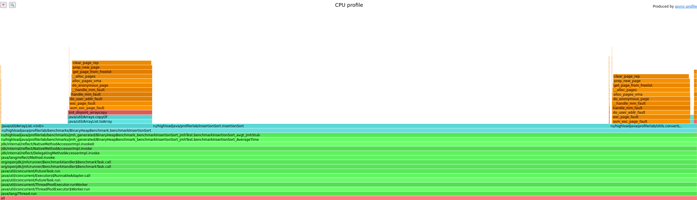
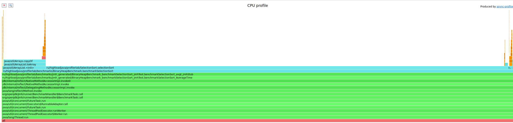
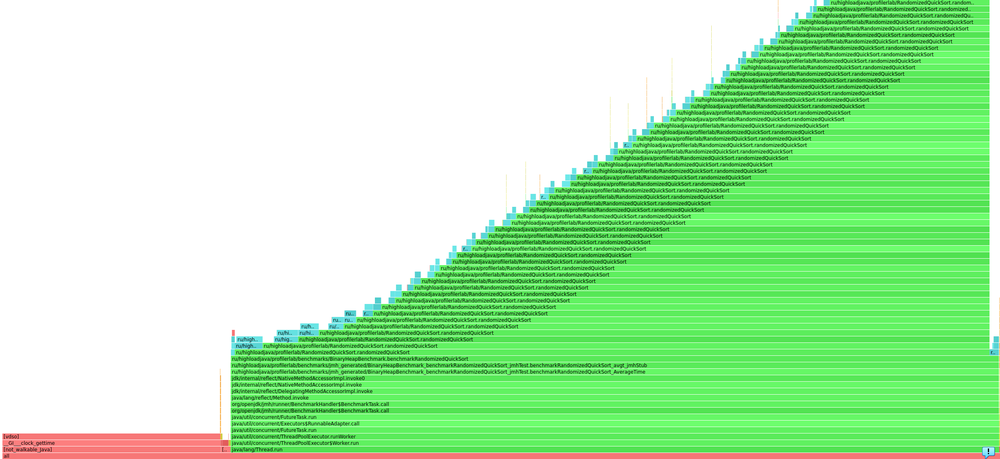
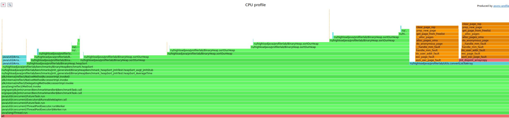
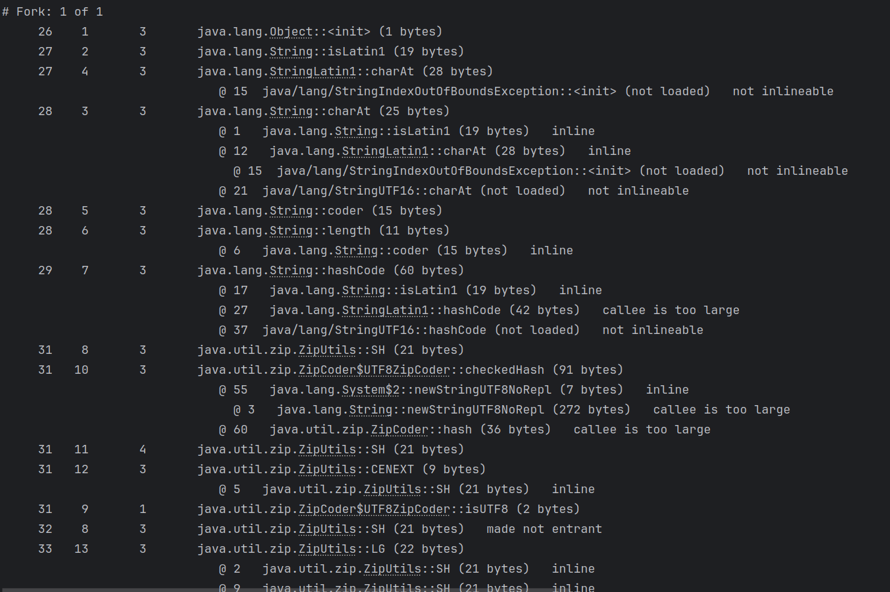

# Lab1 Profiler

В качестве задания была взята бинарная куча (BinaryHeap) и произведено ее сравнение с сортировками выбором, вставкой, 
рандомизированной сортировкой. 

Было осущестлено профилирование сортировок, написан бенчмарк для сравнения производительности
сортировки кучей и классических алгоритмов сортировки, осуществлено профилирование как бенчмарка, так и классов с алгоритмами сортировки,
построены flamegraph для классических алгоритмов сортировки и jmh.

В качестве инструмента профилирования был выбран async-profiler.

## Результаты бенчмарка сравнения алгоритма сортировки в куче с классическими алгоритмами
* Результаты бенчмарка сравнения алгоритмов сортировки и бинарной кучи

Как  мы видим наиболее хорошо с росто числа элементов чувствует себя RandomizedQuickSort и heapSort 

Как  мы видим наиболее хорошо с росто числа элементов чувствует себя RandomizedQuickSort и heapSort

Также обратим внимание, что поиск элемента  в куче происходит быстрее.

## Результаты профилирования алгоритмов сортировок

Продемонстрируем flamegraph алгоритмов сортировок.

* Insertion sort flamegraph

* Selection sort flamegraph

* Randomized quick sort flamegraph
Виден рекурсивный характер алгоритма

* Heap sort flamegraph

## Динамический вывод JIT при профилировании JMH
Пример фрагмента вывода (видно как инициализируется объект)
