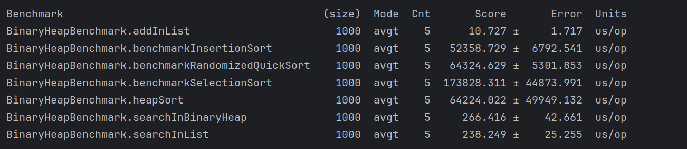
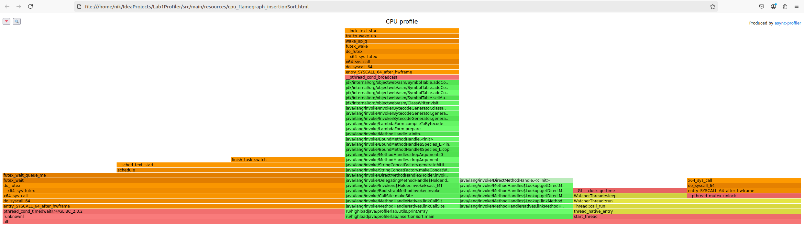
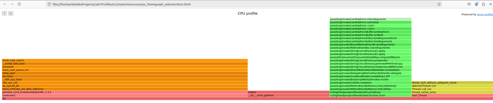
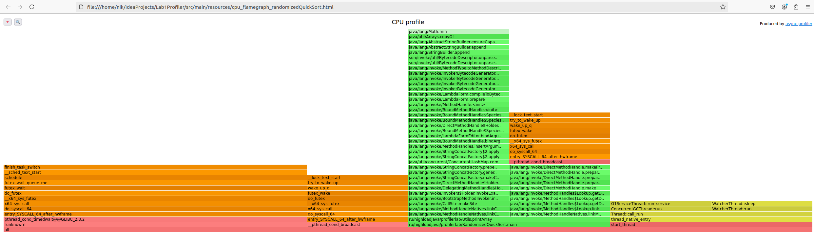
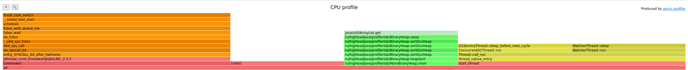
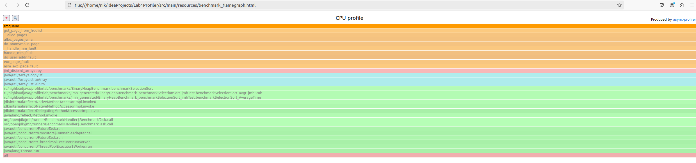
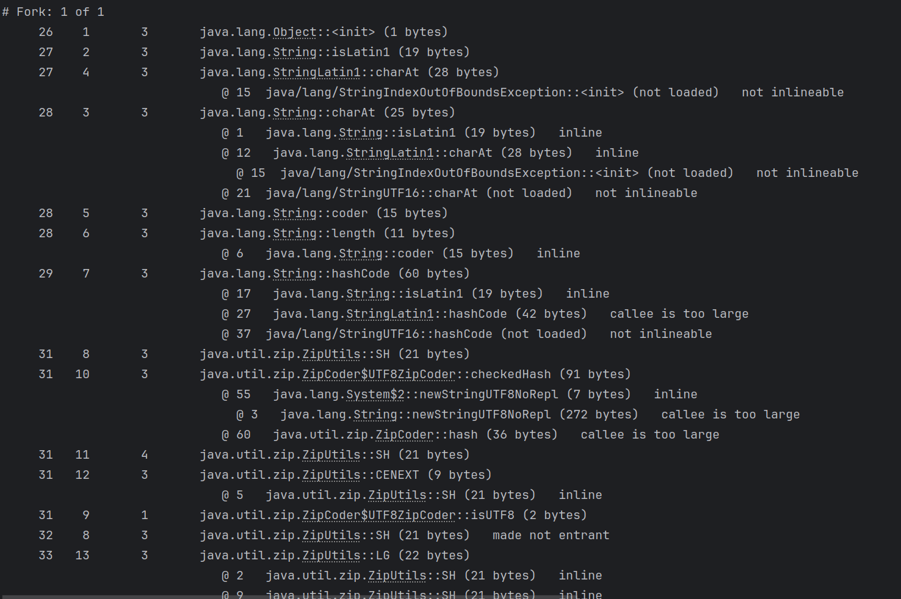

# Lab1 Profiler

В качестве задания была взята бинарная куча (BinaryHeap) и произведено ее сравнение с сортировками выбором, вставкой, 
рандомизированной сортировкой. 

Было осущестлено профилирование сортировок, написан бенчмарк для сравнения производительности
сортировки кучей и классических алгоритмов сортировки, осуществлено профилирование как бенчмарка, так и классов с алгоритмами сортировки,
построены flamegraph для классических алгоритмов сортировки и jmh.

В качестве инструмента профилирования был выбран async-profiler.

## Результаты бенчмарка сравнения алгоритма сортировки в куче с классическими алгоритмами
* Результаты бенчмарка сравнения алгоритмов сортировки и бинарной кучи

По результатам видим, что сортировка вставкой InsertionSort отработал быстрее всего,
чуть медленнее это сделали QuickSort(быстрая сортировка) и HeapSort (сортировка кучей).

Очень медленно работает сортировка выбором (SelectionSort).

Также обратим внимание, что поиск элемента в обычном списке и в куче происходит за сопоставимое время.

## Результаты профилирования алгоритмов сортировок

Продемонстрируем flamegraph алгоритмов сортировок. Предварительно в коде для того, чтобы можно было захватить класс профайлером,
создана задержка потока выполнения.

* Insertion sort flamegraph

* Selection sort flamegraph

* Randomized quick sort flamegraph

* Heap sort flamegraph

## Результаты профилирования jmh
На примере SelectionSort flamegraph jmh

## Динамический вывод JIT при профилировании JMH
Пример фрагмента вывода (видно как инициализируется объект)
